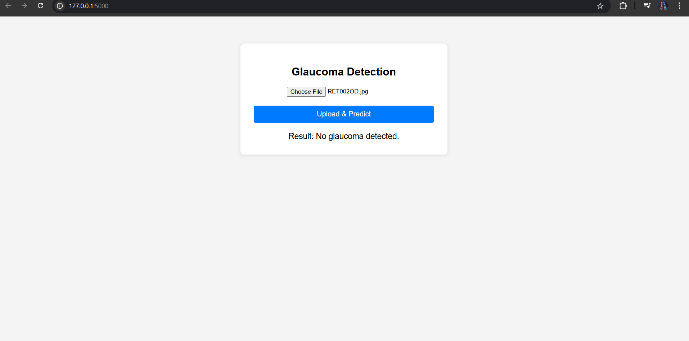

# Glaucoma Detection Web App



Welcome to the Glaucoma Detection project! This is a prototype web application that uses a Quantum Vision Transformer (QVT) model to predict the presence and severity of glaucoma from retinal images. The app features a simple, user-friendly web interface for uploading images and viewing predictions.

## Features
- Upload retinal images and get instant glaucoma predictions
- See if glaucoma is detected and its severity level
- Powered by a custom Quantum Vision Transformer model
- Clean, modern web interface (see screenshot above)

## Screenshot


## How It Works
1. **Upload an image** of a retina (right or left eye) using the web interface.
2. The backend processes the image and runs it through the trained QVT model.
3. The app displays whether glaucoma is detected and, if so, the severity.

## Getting Started

### 1. Clone the Repository
```bash
git clone <your-repo-url>
cd projdata
```

### 2. Set Up the Environment
```bash
python -m venv venv
./venv/Scripts/activate  # On Windows
pip install -r requirements.txt
```

### 3. Train the Model
Make sure your image data and CSV files are in place, then run:
```bash
python train.py
```
This will create a `best_model.pth` file with your trained model.

### 4. Start the Web App
```bash
python app.py
```
Visit [http://127.0.0.1:5000/](http://127.0.0.1:5000/) in your browser.

### 5. Use the App
- Click "Choose File" to select a retinal image.
- Click "Upload & Predict" to see the result.

## Project Structure
```
projdata/
├── app.py              # Flask backend and model loading
├── train.py            # Model training script
├── requirements.txt    # Python dependencies
├── templates/
│   └── index.html      # Web UI
├── cleaned_patient_data_od_with_images.csv  # Right eye data
├── cleaned_patient_data_os_with_images.csv  # Left eye data
├── resize/             # Folder with resized images
├── best_model.pth      # Trained model weights (after training)
├── README.md           # This file
└── screenshot.png      # Screenshot of the web UI
```


---

## 📝 Example Prediction

- **Result: No glaucoma detected.**
- **Result: Glaucoma detected! (Moderate - Moderate damage)**

---

## ⚠️ Notes & Limitations

- This is a **prototype** and **not for clinical use**.
- The quantum layer is simulated; for real quantum computing, integrate with PennyLane and a quantum backend.
- The model may need more data, tuning, and validation for real-world deployment.
- Large image folders and virtual environments are excluded from git for size reasons.

---

## 📚 References

- [Vision Transformer (ViT) Paper](https://arxiv.org/abs/2010.11929)
- [PennyLane: Quantum Machine Learning](https://pennylane.ai/)
- [PyTorch Documentation](https://pytorch.org/docs/stable/index.html)

---

## 📄 License

MIT License

---

*Made with ❤️ for learning, research, and prototyping. If you have questions or want to contribute, feel free to open an issue or pull request!*
